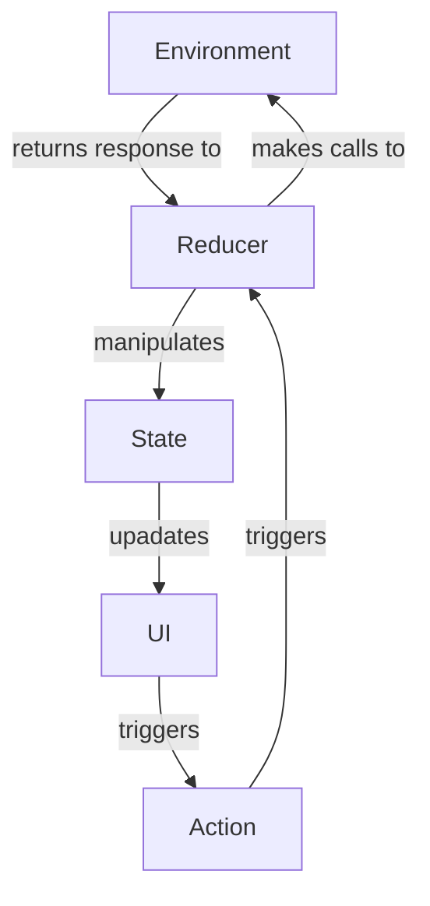

# What is The Composable Architecture

It is an architecture aimed to be used for building applications with varying purposes and complexity. The basic flow of TCA roughly looks like the following diagram:

-   **State**: A type that describes the data your feature needs to perform its logic and render its UI.
```swift
struct AppState: Equatable {
  var count = 0
  var numberFactAlert: String?
}
```
-   **Action**: A type that represents all of the actions that can happen in your features, such as user actions, notifications, event sources, and more. ^730e65
```swift
enum AppAction: Equatable {
  case factAlertDismissed
  case decrementButtonTapped
  case incrementButtonTapped
  case numberFactButtonTapped
  case numberFactResponse(Result<String, ApiError>)
}

struct ApiError: Error, Equatable {}
```
-   **Environment**: A type that holds any dependencies the feature needs, such as API clients, analytics clients, etc.
-   **Reducer**: A function that describes how to evolve the current state of the app to the next state given an action. The reducer is also responsible for returning any effects that should be run, such as API requests, which can be done by returning an `Effect` value. ^455532
-   **Store**: The runtime that actually drives your feature. You send all user actions to the store so that the store can run the reducer and effects, and you can observe state changes in the store so that you can update UI.